# typescript + react-native开发仿喜马拉雅app

# 环境搭建
## 下载jdk
  * 下载地址: https://www.oracle.com/java/technologies/javase-downloads.html
  *     
     
    注意：推荐下载jdk1.8及以上的版本，下载之后配置环境变量   
  

## 下载android studo
  * 下载地址: https://developer.android.google.cn/studio/    
     
    android studo推荐使用3.5以上的版本，然后下载android sdk，选择8.1以上的版本    
      
  * 
  * 
  
## 创建react-native项目(typescript)
  * 输入命令：npx react-native init MyApp --template react-native-template-typescript

***

# 打包APK
  1. 生成keyStore
       * 在当前目录下输入命令：
        ```
          keytool -genkey -v -keystore my-release-key.keystore -alias my-key-alias -keyalg RSA -keysize 2048 -validity 10000
        ```

       * 输入密码和确认的密码之后，其他不用填，一直回车, 

  2. 将生成的my-release-key.keystore文件放到android/app文件夹下：

  3. 编辑android\gradle.properties文件，添加如下的代码（注意把其中的****替换为相应密码）
        ```
          MYAPP_RELEASE_STORE_FILE=my-release-key.keystore
          MYAPP_RELEASE_KEY_ALIAS=my-key-alias
          MYAPP_RELEASE_STORE_PASSWORD=123456
          MYAPP_RELEASE_KEY_PASSWORD=123456
        ```

  4. 编辑android/app/build.gradle文件，添加以下配置：
        ```
          android {
              ...
              defaultConfig { ... }
              signingConfigs {
                  release {
                      storeFile file(MYAPP_RELEASE_STORE_FILE)
                      storePassword MYAPP_RELEASE_STORE_PASSWORD
                      keyAlias MYAPP_RELEASE_KEY_ALIAS
                      keyPassword MYAPP_RELEASE_KEY_PASSWORD
                  }
              }
              buildTypes {
                  release {
                      ...
                      signingConfig signingConfigs.release
                  }
              }
          }
        ```

  5. 执行命令：
        ```
          cd android && ./gradlew assembleRelease

          或者在package.json配置下
           "scripts": {
              ...
              "release": "cd android && ./gradlew assembleRelease"
            },

          执行npm run release
        ```

# 修改app的名称（安卓）
  * 修改android\app\src\main\res\values\strings.xml文件即可

# 修改应用图标(安卓)
  * 修改android\app\src\main\AndroidManifest.xml里面的
      ```
        ic_launcher是图片的名称，可改，不改的话，替换android\app\src\main\res里面的图片即可

        <application
          ...
          android:icon="@mipmap/ic_launcher"
        >
      ```

  * 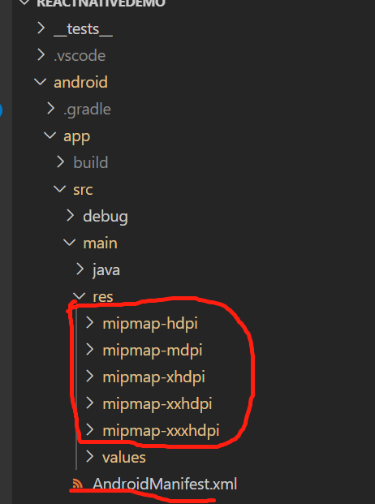

# ios打包
  1. 在ios文件夹下，新建bundle文件夹，通过命令将包编译到本地
      ```
        react-native bundle --platform ios --dev false --entry-file index.js  --bundle-output  ios/bundle/index.ios.bundle  --assets-dest ios/bundle
      ```

  2. 为了方便，在package.json中添加编译命令：
      ```
          "scripts": {
            ...
            "bundle-ios": "react-native bundle --platform ios --dev false --entry-file index.js  --bundle-output  ios/bundle/index.ios.bundle  --assets-dest ios/bundle"
          },
      ```

  3. 打开xCode,引入ios文件夹，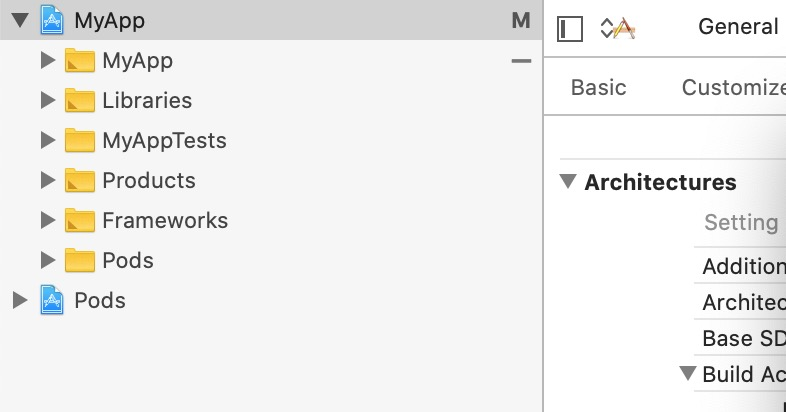
  
  4. 右键打开项目同名的iotApp的菜单，Add Files to "RNIos"， 
  
  5. 选中bundle,勾选create foider refrences，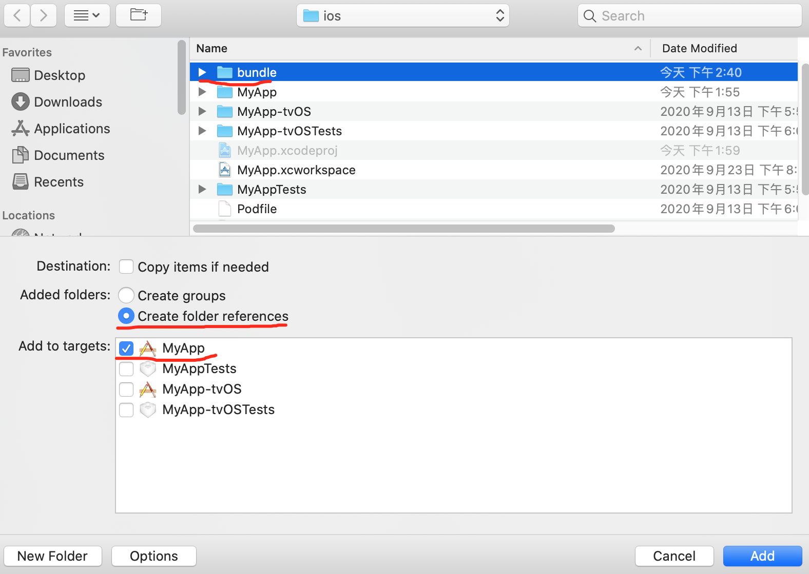

  6. 添加到项目中的文件夹必须是蓝色的，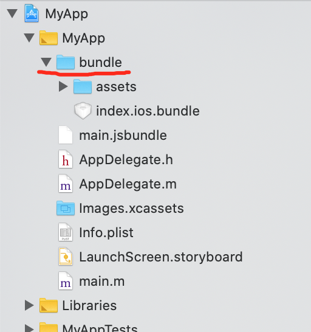

  7. 修改xcode的debug状态，Xcode——Product——Schema——Edit Scheme，查看run选择的模式，将项目由debug状态改成release状态
    * 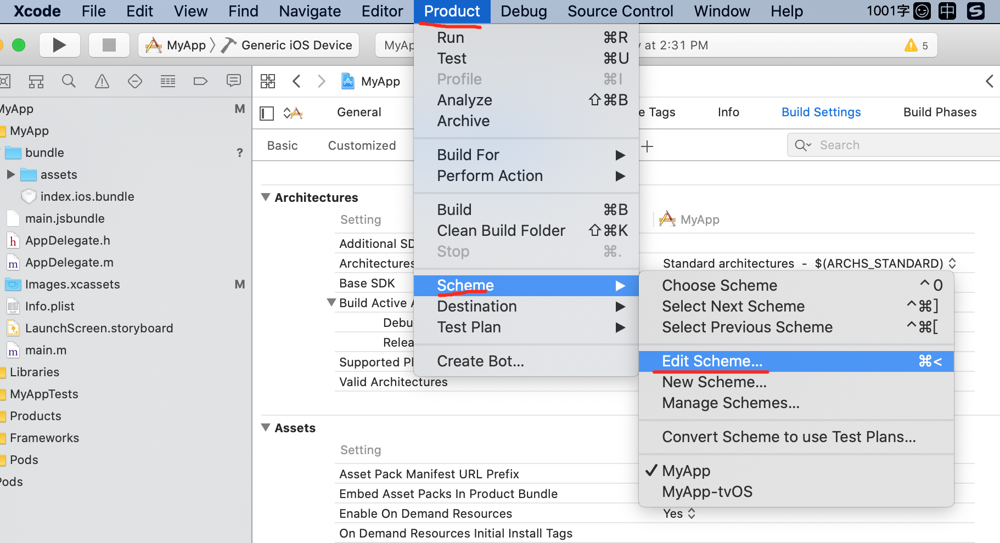
    * 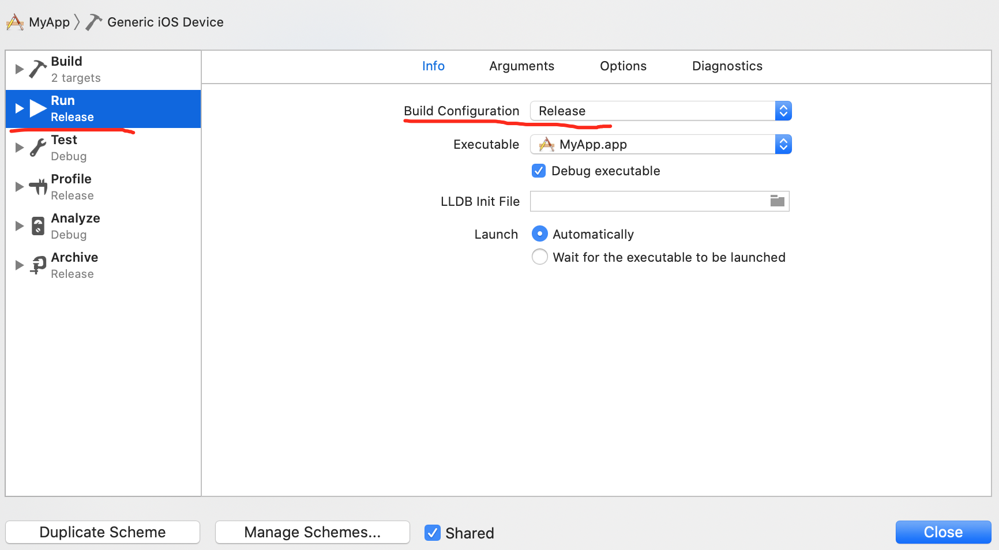

  8. 在左上角选中MyApp > Ceneric IOS Device, 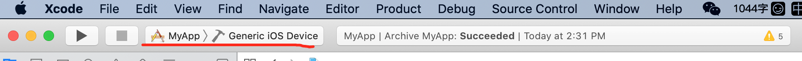
  
  9. 点击xcode ios里的根目录，在General和Signing & Capabilities菜单中，填写项目信息 
    * 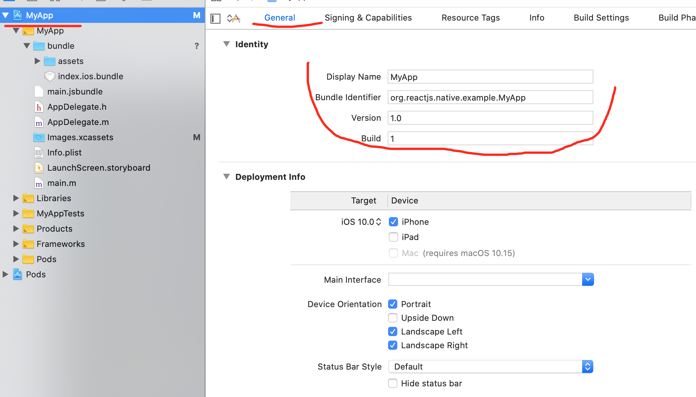
    * 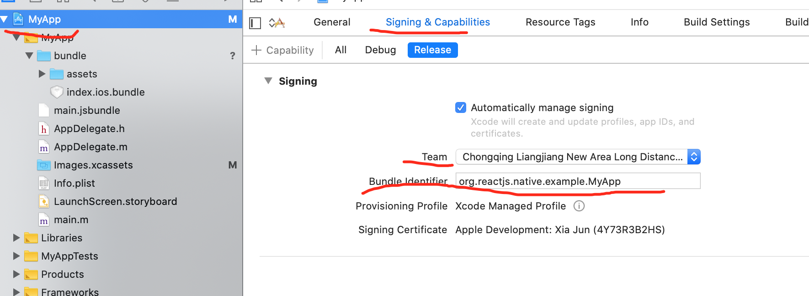
  
  10. 点击Product——Archive开始打包。显示build完成之后，显示如下弹框：点击Distribute App
    * 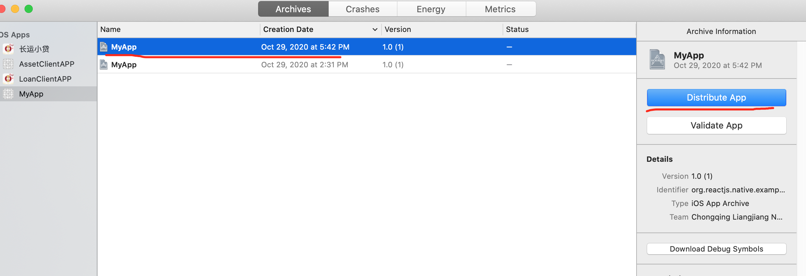
    * 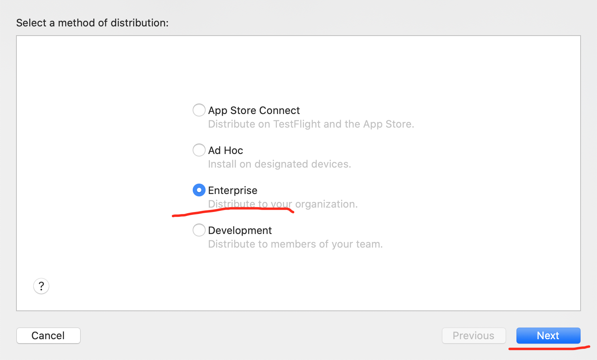
    * 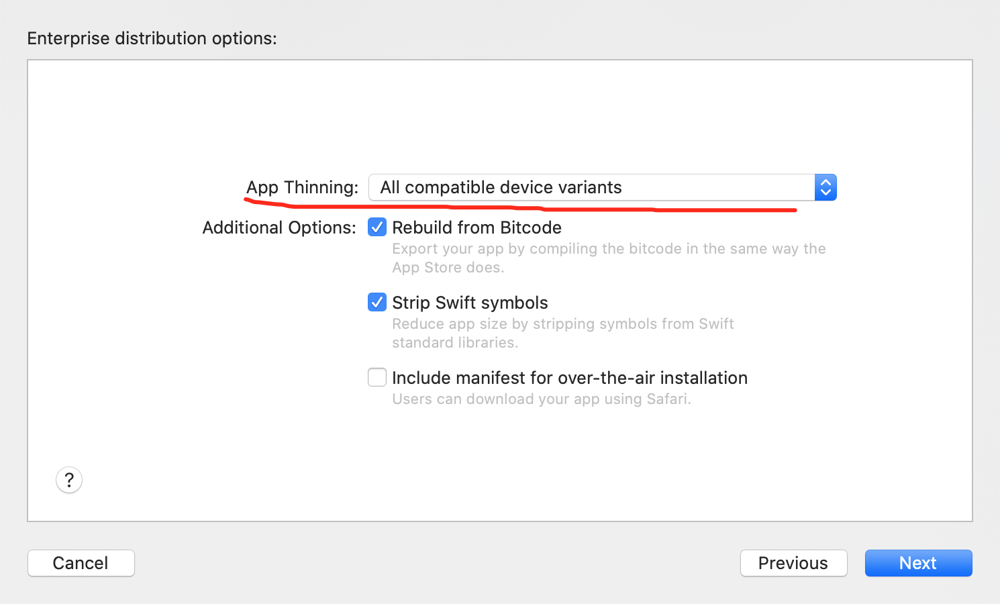
    * 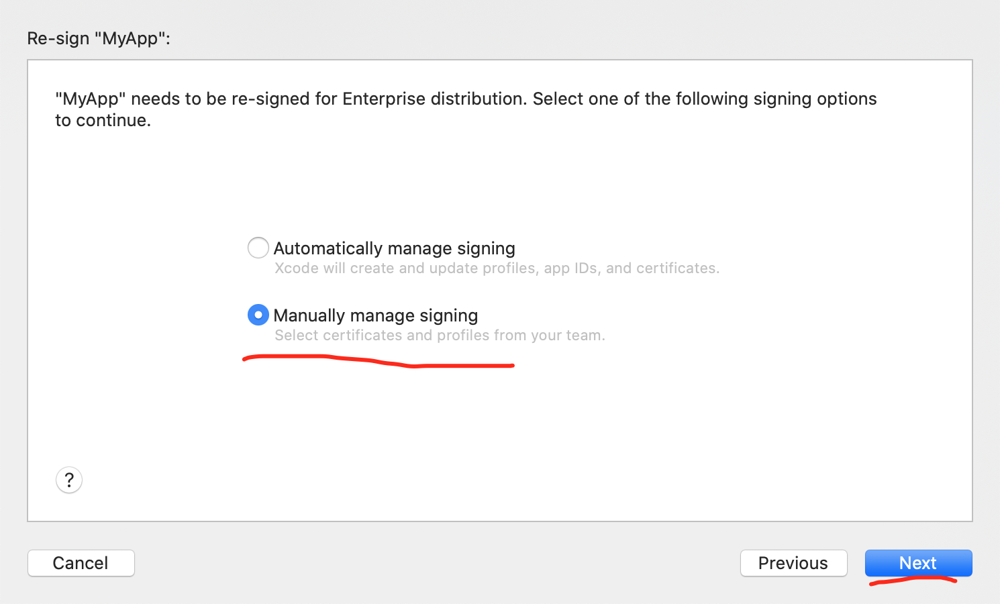
    * 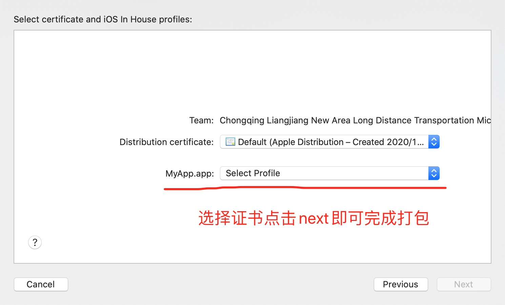

# 项目开发经验
## UI框架react-native-mobile
使用步骤：
  1. 核心包下载：
    ```
      npm install @ant-design/react-native --save
    ```

  2. 使用：
    ```
      import React, { Component } from 'react';
      import { AppRegistry } from 'react-native';
      import Button from '@ant-design/react-native/lib/button';

      class HelloWorldApp extends Component {
        render() {
          return <Button>Start</Button>;
        }
      }

      AppRegistry.registerComponent('HelloWorldApp', () => HelloWorldApp);
    ```

  3. 详细文档请看：https://rn.mobile.ant.design/index-cn

## 多环境配置
  * 详细文档请看: https://github.com/luggit/react-native-config

  * 下载安装包:   当前版本("react-native-config": "^1.3.1")
    ```
      yarn add react-native-config
    ```
  
  * 连接库: (react-native 0.60版本后可以不执行这个命令)
    ```
      npx react-native link react-native-config
    ```

  * ios端需要连接库:
    ```
      在当前项目下进入ios目录, 执行:
      pod install
    ```

  * android端链接库:
    1. 在当前项目下的android/settings.gradle添加：
    ```
      include ':react-native-config'

      project(':react-native-config').projectDir = new File(rootProject.projectDir, '../node_modules/react-native-config/android') 
    ```

    2. 将插件添加到android/app/build.gradle中：
      ```
        apply from: project(':react-native-config').projectDir.getPath() + "/dotenv.gradle"
      ```

  * 基本使用
    1. 在项目根路径下新建.env.development和.env.production文件,写点内容(文件名一定要.env开头，否则没有效果)
      ```
        API_URL=https://myapi.com
        GOOGLE_MAPS_API_KEY=abcdefgh
      ```
    
    2. 在package.json中，添加命令:
      ```
        "dev": "SET ENVFILE=.env.development && react-native run-android",
        "prod": "SET ENVFILE=.env.production && react-native run-android"
      ```

    3. 在js项目中使用该配置：
      ```
        import Config from "react-native-config";

        console.log(Config.API_URL); // 'https://myapi.com'
      ```

    4. 在android工程中使用多环境:
      ```
        # 进入到andorid目录，执行: 
        ENVFILE=.env.development ./gradlew assembleRelease
      ```

    5. 在ios工程中使用多环境: 
      ```
        The basic idea in iOS is to have one scheme per environment file, so you can easily alternate between them.

        Start by creating a new scheme:

        In the Xcode menu, go to Product > Scheme > Edit Scheme
        Click Duplicate Scheme on the bottom
        Give it a proper name on the top left. For instance: "Myapp (staging)"
        Then edit the newly created scheme to make it use a different env file. From the same "manage scheme" window:

        Expand the "Build" settings on left
        Click "Pre-actions", and under the plus sign select "New Run Script Action"
        Where it says "Type a script or drag a script file", type:

        cp ${PROJECT_DIR}/../.env.staging .env  # replace .env.staging for your file
      ```

## 配置绝对路径
  * 为了防止引入时不断的../，使用babel-plugin-module-resolver

  * 下载安装包: 
    ```
      yarn add babel-plugin-module-resolver
    ```

  * 在babel.config.js中改造并添加: 
    ```
      plugins: [
        [
          'module-resolver',
          {
            root: ['./src'],
            alias: {
              '@/utils': './src/utils',
              '@/pages': './src/pages',
              '@/components': './src/components',
              '@/models': './src/models',
              '@/assets': './src/assets'
            }
          }
        ]
      ]
    ```

  * 在tsconfig.json中修改配置：
    ```
      "baseUrl": "./src",                         
      "paths": {
        "@/assets/*": ["assets/*"],
        "@/components/*": ["components/*"],
        "@/models/*": ["models/*"],
        "@/pages/*": ["pages/*"],
        "@/utils/*": ["utils/*"],
      },
    ```
    
  * 使用方式和vue完全一样，以根路径为@
    ```
      import App from '@/src/pages/Home/Main'
    ```

## 导航器react-navigation（5.x）
  1. 安装核心包：
    ```
      yarn add @react-navigation/native
    ```

  2. 安装相应的依赖包：
    ```
      yarn add react-native-reanimated react-native-gesture-handler react-native-screens react-native-safe-area-context @react-native-community/masked-view
    ```

  3. 在根路径的index.js中引入react-native-gesture-handler，否则生产环境会报错

  4. 在你应用的根路径Home/index.tsx中，使用NavigationContainer进行包裹：
    ```
      import 'react-native-gesture-handler';
      import {AppRegistry} from 'react-native';
      import App from '@/src/pages/Home';
      import {name as appName} from './app.json';
      import { NavigationContainer } from '@react-navigation/native';

      AppRegistry.registerComponent(appName, () => <NavigationContainer><App /></NavigationContainer>);
    ```

### 堆栈式导航器
  1. 安装核心包：
    ```
      yarn add @react-navigation/stack
    ```

  2. 创建堆栈式导航器   
      * createStackNavigator标签包含两个子组件Screen和Navigator
      ```
        import React, { Component } from 'react'
        import { NavigationContainer } from '@react-navigation/native'
        import { createStackNavigator } from '@react-navigation/stack'
        import Home from '@/pages/Home'
        import Detail from '@/pages/Home/Detail'

        type RootStackList = { // 定义类型别名
          Home: undefined,
          Detail: undefined
        }

        let Stack = createStackNavigator<RootStackList>()

        export default class Navigator extends Component {
          render() {
            return (
              <NavigationContainer>
                <Stack.Navigator>
                  <Stack.Screen
                    options={{
                      headerTitleAlign: 'center',
                      headerTitle: '首页'
                    }}
                    name="Home"
                    component={Home}
                  />
                  <Stack.Screen 
                    name="Detail" 
                    component={Detail}
                    options={{
                      headerTitleAlign: 'center',
                      headerTitle: '详情页首页'
                    }}
                  />
                </Stack.Navigator>
              </NavigationContainer>
            )
          }
        }

        # 最后在根路径引入即可
      ```

      * Stack.Navigator可以接收screenOptions属性，用于配置所有的导航器的样式

  3. 页面传参：
       * home页面跳转到detail页面
         ```
           # home页面传递：
             this.props.navigation.navigate('Detail', {id: '123'})

           # detail页面接收
             <Text> {this.props.route.params.id} </Text>
         ``` 

       * 详细代码请看
           * router/index.tsx里： 
              ```
                import React, { Component } from 'react'
                import { NavigationContainer } from '@react-navigation/native'
                import { createStackNavigator, StackNavigationProp, HeaderStyleInterpolators, CardStyleInterpolators } from '@react-navigation/stack'
                import Home from '@/pages/Home'
                import Detail from '@/pages/Home/Detail'

                export type RootStackList = { // 定义类型别名，用于约束navigator组件，在添加组件时，这里必须声明类型
                  Home: undefined,
                  Detail: {
                    id: string
                  }
                }

                // 该类型申明约束每一个页面组件的props
                export type RootStackNavigation = StackNavigationProp<RootStackList>

                let Stack = createStackNavigator<RootStackList>()

                export default class Navigator extends Component {
                  render() {
                    return (
                      <NavigationContainer>
                        <Stack.Navigator
                          headerMode='screen'
                          screenOptions={{
                            headerTitleAlign: 'center', // 标题内容居中
                            // 下面两句是统一ios和安卓的页面切换效果
                            headerStyleInterpolator: HeaderStyleInterpolators.forUIKit,
                            cardStyleInterpolator: CardStyleInterpolators.forHorizontalIOS,
                            // 开启安卓的切换手势
                            gestureEnabled: true,
                            gestureDirection: 'horizontal'
                          }}
                        >
                          <Stack.Screen
                            options={{
                              headerTitle: '首页'
                            }}
                            name="Home"
                            component={Home}
                          />
                          <Stack.Screen 
                            name="Detail" 
                            component={Detail}
                            options={{
                              headerTitle: '详情页'
                            }}
                          />
                        </Stack.Navigator>
                      </NavigationContainer>
                    )
                  }
                }
              ```

            * Home.tsx里：
              ```
                import React, { Component } from 'react'
                import { Text, View, Button } from 'react-native'
                import { RootStackNavigation } from '@/router/index'

                interface homeProps {
                  navigation: RootStackNavigation
                }

                export default class Home extends Component<homeProps> {
                  render() {
                    return (
                      <View>
                        <Text> textInComponent </Text>
                        <Button title='跳转到详情页面' onPress={()=>{
                          this.props.navigation.navigate('Detail', {id: '123'})
                        }} />
                      </View>
                    )
                  }
                }
              ```

            * Detail.tsx里：
              ```
                import React, { Component } from 'react'
                import { Text, View } from 'react-native'
                import { RootStackList } from '@/router/index'
                import { RouteProp } from '@react-navigation/native'

                interface Iprops{
                  route: RouteProp<RootStackList, 'Detail'>
                }

                export default class Detail extends Component<Iprops> {
                  render() {
                    console.log(this.props)
                    return (
                      <View>
                        <Text> {this.props.route.params.id} </Text>
                      </View>
                    )
                  }
                }

              ```

  4. 注意：   
       * 设置标题位置为居中还是居左：Stack.Navigator组件的screenOptions属性
         ```
           <Stack.Navigator
             screenOptions={{
               headerTitleAlign: 'center', // 标题内容居中
             }}
           ></Stack.Navigator>
         ```

       * 设置页面切换的动画效果（统一ios）：Stack.Navigator组件的headerStyleInterpolator和cardStyleInterpolator属性
         ```
           <Stack.Navigator
             screenOptions={{
               // 设置页面切换的风格
               headerStyleInterpolator: HeaderStyleInterpolators.forUIKit, // 头部统一
               cardStyleInterpolator: CardStyleInterpolators.forHorizontalIOS // 页面主体内容统一
             }}
           >
         ```

       * 隐藏导航栏：Stack.Navigator组件的headerMode属性
         ```
           <Stack.Navigator
             headerMode='node'
           >
         ```

       * 开启安卓的切换手势(默认是关闭的)：Stack.Navigator组件的screenOptions属性
          ```
            <Stack.Navigator
              screenOptions={{
                // 开启安卓的切换手势
                gestureEnabled: true,
                gestureDirection: 'horizontal'
              }}
            >
          ```

  5. 详细文档请看: https://reactnavigation.org/docs/stack-navigator

### 标签导航器
  1. 安装核心包：
    ```
      yarn add @react-navigation/bottom-tabs
    ```

  2. 创建底部导航器
    * createBottomTabNavigator标签包含两个子组件Screen和Navigator
      ```
        import React, { Component } from 'react'
        import { NavigationContainer } from '@react-navigation/native'
        import { createBottomTabNavigator } from '@react-navigation/bottom-tabs'
        import Home from '@/pages/Home'
        import Account from '@/pages/Account'
        import Found from '@/pages/Found'
        import Listen from '@/pages/Listen'

        export type BottomTabParamList = {
          Home: undefined,
          Found: undefined,
          Listen: undefined,
          Account: undefined
        }

        const Tab = createBottomTabNavigator<BottomTabParamList>()


        export default class BottomTabs extends Component {
          render() {
            return (
              <NavigationContainer>
                <Tab.Navigator tabBarOptions={{
                  activeTintColor: '#c71622'
                }}>
                  <Tab.Screen name='Home' component={Home} options={{ tabBarLabel: '首页' }}></Tab.Screen>
                  <Tab.Screen name='Listen' component={Listen} options={{ tabBarLabel: '我听' }}></Tab.Screen>
                  <Tab.Screen name='Found' component={Found} options={{ tabBarLabel: '发现' }}></Tab.Screen>
                  <Tab.Screen name='Account' component={Account} options={{ tabBarLabel: '用户' }}></Tab.Screen>
                </Tab.Navigator>
              </NavigationContainer>
            )
          }
        }

        # 最后在根路径引入即可
      ```

  3. 堆栈导航器嵌套底部导航栏
    * 在router/index.tsx里：
      ```
        import React, { Component } from 'react'
        import { NavigationContainer } from '@react-navigation/native'
        import { createStackNavigator, StackNavigationProp, HeaderStyleInterpolators, CardStyleInterpolators } from '@react-navigation/stack'
        import Detail from '@/pages/Home/Detail'
        import BottomTabs from '@/router/BottomTabs'

        export type RootStackList = { // 定义类型别名，用于约束navigator组件，在添加组件时，这里必须声明类型
          Tab: {
            screen?: string
          },
          Detail: {
            id: string
          }
        }

        // 该类型申明约束每一个页面组件的props
        export type RootStackNavigation = StackNavigationProp<RootStackList>

        let Stack = createStackNavigator<RootStackList>()

        export default class Navigator extends Component {
          render() {
            return (
              <NavigationContainer>
                <Stack.Navigator
                  headerMode='screen'
                  screenOptions={{
                    headerTitleAlign: 'center', // 标题内容居中
                    // 下面两句是统一ios和安卓的页面切换效果
                    headerStyleInterpolator: HeaderStyleInterpolators.forUIKit,
                    cardStyleInterpolator: CardStyleInterpolators.forHorizontalIOS,
                    // 开启安卓的切换手势
                    gestureEnabled: true,
                    gestureDirection: 'horizontal'
                  }}
                >
                  <Stack.Screen
                    name="Tab"
                    component={BottomTabs}
                  />
                  <Stack.Screen 
                    name="Detail" 
                    component={Detail}
                    options={{
                      headerTitle: '详情'
                    }}
                  />
                </Stack.Navigator>
              </NavigationContainer>
            )
          }
        }
      ```

    * 在router/BottomTabs.tsx里：
      ```
        import React, { Component } from 'react'
        import { NavigationContainer } from '@react-navigation/native'
        import { createStackNavigator, StackNavigationProp, HeaderStyleInterpolators, CardStyleInterpolators } from '@react-navigation/stack'
        import Detail from '@/pages/Home/Detail'
        import BottomTabs from '@/router/BottomTabs'

        export type RootStackList = { // 定义类型别名，用于约束navigator组件，在添加组件时，这里必须声明类型
          Tab: {
            screen?: string
          },
          Detail: {
            id: string
          }
        }

        // 该类型申明约束每一个页面组件的props
        export type RootStackNavigation = StackNavigationProp<RootStackList>

        let Stack = createStackNavigator<RootStackList>()

        export default class Navigator extends Component {
          render() {
            return (
              <NavigationContainer>
                <Stack.Navigator
                  headerMode='screen'
                  screenOptions={{
                    headerTitleAlign: 'center', // 标题内容居中
                    // 下面两句是统一ios和安卓的页面切换效果
                    headerStyleInterpolator: HeaderStyleInterpolators.forUIKit,
                    cardStyleInterpolator: CardStyleInterpolators.forHorizontalIOS,
                    // 开启安卓的切换手势
                    gestureEnabled: true,
                    gestureDirection: 'horizontal'
                  }}
                >
                  <Stack.Screen
                    name="Tab"
                    component={BottomTabs}
                  />
                  <Stack.Screen 
                    name="Detail" 
                    component={Detail}
                    options={{
                      headerTitle: '详情'
                    }}
                  />
                </Stack.Navigator>
              </NavigationContainer>
            )
          }
        }
      ```

    * 在根路径的index.js中，引入Navigator即可

## 状态管理dva
  * 核心包安装：
    ```
      yarn add dva-core-ts react-redux @types/react-redux dva-loading-ts

    ```

  * 使用步骤
    1. 创建实例
    2. 加载model对象
    3. 启动dva
    4. 导出dva对象 
    5. 在src/index.tsx中用provider包裹所有的组件
    6. 详细代码请看：
      * 在config/dva.ts中：
        ```
          import { create } from 'dva-core-ts'
          import models from '@/models/index'
          // 1. 创建实例
          const app = create()
          // 2. 加载model对象
          models.forEach(model => {
              app.model(model)
          })
          // 3. 启动dva
          app.start()
          // 4. 导出dva的数据
          export default app._store
        ```

      * 在models/index.ts中： 
        ```
          import home, { HomeState } from '@/models/home'
          import { DvaLoadingState } from 'dva-loading-ts'

          const models = [home];
          export type RootState = {
            home: HomeState,
            loading: DvaLoadingState
          }
          export default models;
        ```

      * 在models/home.ts中：
        ```
          import { Model, Effect } from 'dva-core-ts'
          import { Reducer } from 'react'

          export interface HomeState {
            num: number
          }

          interface HomeModel extends Model {
            namespace: 'home';
            state: HomeState;
            reducers: {
              add: Reducer<HomeState, any>;
              asyncAddResult: Reducer<HomeState, any>;
            }
            effects: {
              asyncAdd: Effect
            }
          }

          const initialState = {
            num: 0
          }

          type codeType = { // 定义页面传过来的对象类型
            num: number,
            initNumber: number
          }

          function delay(code: codeType) {
            return code.num + code.initNumber
          }

          const homeHodel: HomeModel = {
            namespace: 'home',
            state: initialState,
            effects: { // 异步操作
              *asyncAdd({ payload }, { call, put }) {
                const res = yield call(delay, payload)
                yield put({
                  type: 'asyncAddResult',
                  payload: res,
                })
              }
            },
            reducers: { // 同步操作
              add(state = initialState, { payload }) {
                console.log('payload', payload)
                return {
                  ...state,
                  num: state.num + payload.num
                }
              },
              asyncAddResult(state = initialState, { payload }) {
                console.log('payload', payload)
                return {
                  ...state,
                  num: payload
                }
              }
            }
          }

          export default homeHodel
        ```

      * 在src/pages/Home/index.tsx里，使用
        ```
          import React, { Component } from 'react'
          import { Text, View, Button } from 'react-native'
          import { RootStackNavigation } from '@/router/index'
          import { connect, ConnectedProps } from 'react-redux'
          import { RootState } from '@/models/index'

          function mapStateToProps(state: RootState) {
            return {
              num: state.home.num
            }
          }

          const connector = connect(mapStateToProps)

          type ModelState = ConnectedProps<typeof connector> // 定义connect的类型

          // 去继承ModalState否则在render里取store里的this.props.num会报错
          interface homeProps extends ModelState {
            navigation: RootStackNavigation
          }

          class Home extends Component<homeProps> {
            handleAdd = () => {
              const { dispatch } = this.props
              dispatch({
                type: 'home/add',
                payload: {
                  num: 1
                }
              })
            }

            handleAsyncAdd = () => {
              const { dispatch, num } = this.props
              dispatch({
                type: 'home/asyncAdd',
                payload: {
                  num: 2,
                  initNumber: num
                }
              })
            }

            render() {
              return (
                <View>
                  <Text> {this.props.num} </Text>
                  <Button title='加' onPress={() => this.handleAdd()} />
                  <Button title='异步加' onPress={() => this.handleAsyncAdd()} />
                  <Button title='跳转到详情页面' onPress={() => {
                    this.props.navigation.navigate('Detail', { id: '123' })
                  }} />
                </View>
              )
            }
          }

          export default connector(Home)
        ```

  * 在dva中使用自带的loading
    * 使用步骤：
      1. 安装依赖包：yarn add dva-loading-ts

      2. 在config/dva.ts中，引入createLoading
        ```
          import { create } from 'dva-core-ts'
          import createLoading from 'dva-loading-ts'
          import models from '@/models/index'
          // 1. 创建实例
          const app = create()
          // 2. 加载model对象
          models.forEach(model => {
              app.model(model)
          })
          app.use(createLoading())
          // 3. 启动dva
          app.start()
          // 4. 导出dva的数据
          export default app._store
        ```

      3. 在Home/index.tsx中的mapStateToProps函数中使用（effects里面要选择loading的函数）
        ```
          function mapStateToProps(state: RootState) {
            return {
              num: state.home.num,
              loading: state.loading.effects['home/asyncAdd']
            }
          }
        ```
    
## 提示框react-native-root-toast
使用步骤：    
  1. 下载核心包:
    ```
      yarn add react-native-root-toast 或者 npm install --save react-native-root-toast
    ```

  2. 当react-native的版本>0.62时，需要在根路径src/index.tsx或者App.tsx中，加入以下代码：
    ```
      import { RootSiblingParent } from 'react-native-root-siblings';

      return (
        <RootSiblingParent>  // <- use RootSiblingParent to wrap your root component
          <App />
        </RootSiblingParent>
      );
    ```

  3. 使用:
    ```
      import Toast from 'react-native-root-toast';

      Toast.show('This is a message', {
        duration: Toast.durations.LONG,
        position: Toast.positions.BOTTOM,
        shadow: true,
        animation: true,
        hideOnPress: true,
        delay: 0,
      });
    ```

  4. 详细说明文档请看：https://github.com/magicismight/react-native-root-toast

## 提示组件react-native-root-toast
使用步骤：
  1. 下载核心包：
    ```
      npm install --save react-native-root-toast
      npm install --save react-native-root-siblings
    ```

  2. 在react-native版本大于0.62时，需要在根路径src/index.tsx中插入一个挂载点：
    ```
      import { RootSiblingParent } from 'react-native-root-siblings';

      return (
        <RootSiblingParent>  // <- use RootSiblingParent to wrap your root component
          <App />
        </RootSiblingParent>
      );
    ```

  3. 具体使用：
    * 函数式：
      ```
        import Toast from 'react-native-root-toast';

        let toast = Toast.show('This is a message', {
            duration: Toast.durations.LONG,
            position: Toast.positions.BOTTOM,
            shadow: true,
            animation: true,
            hideOnPress: true,
            delay: 0,
            onShow: () => {
                // calls on toast\`s appear animation start
            },
            onShown: () => {
                // calls on toast\`s appear animation end.
            },
            onHide: () => {
                // calls on toast\`s hide animation start.
            },
            onHidden: () => {
                // calls on toast\`s hide animation end.
            }
        });

        setTimeout(function () {
            Toast.hide(toast);
        }, 500);
      ```

    * 组件式：
      ```
        import React, {Component} from 'react-native';
        import Toast from 'react-native-root-toast';

        class Example extends Component{
            constructor() {
                super(...arguments);
                this.state = {
                    visible: false
                };
            }

            componentDidMount() {
                setTimeout(() => this.setState({
                    visible: true
                }), 2000); // show toast after 2s

                setTimeout(() => this.setState({
                    visible: false
                }), 5000); // hide toast after 5s
            };

            render() {
                return <Toast
                    visible={this.state.visible}
                    position={50}
                    shadow={false}
                    animation={false}
                    hideOnPress={true}
                >This is a message</Toast>;
            }
        }
      ```
  
  4. 详细文档：https://github.com/magicismight/react-native-root-toast#readme
## 弹窗组件react-native-modalbox
使用步骤：    
  1. 下载核心包：
    ```
      npm install react-native-modalbox@latest --save
      npm install --save-dev @types/react-native-modalbox
    ```

  2. 使用：
    ```
      import Modal from 'react-native-modalbox'

      <Modal
        isOpen={this.state.visible}
        style={{height: UnitConvert.dpi(300)}}
        position='top'
        startOpen
        onClosed={()=>{
          this.setState({
            visible: false
          })
        }}
      >
        <Text>2222</Text>
      </Modal>
    ```

  3. 详细文档: https://github.com/maxs15/react-native-modalbox#readme

## 可滑动的选择组件react-native-picker
使用步骤：     
  1. 下载核心包:
    ```
      npm install --save react-native-picker
    ```

  2. 使用：
    ```
      import Picker from 'react-native-picker'

      _showDatePicker = () => {
        Picker.init({
          pickerTitleText: '时间选择',
          pickerCancelBtnText: '取消',
          pickerConfirmBtnText: '确定',
          selectedValue: [3],                     // 选中的数据
          pickerBg: [255, 255, 255, 1],           // 内容的背景区域
          pickerData: [1, 2, 3, 4],               // 数据源
          pickerFontColor: [33, 33, 33, 1],       // 内容的文字大小
          onPickerCancel: (data) => {             // 点击取消的回调
            console.log('date', data);
          },
          onPickerSelect: (data) => {             // 点击确定时的回调
            console.log('date', data);
          }
        });
        Picker.show();
      }

      <TouchableOpacity
        style={styles.modal_box}
        onPress={() => {
          this._showDatePicker()
        }}
      >
        <Text style={styles.modal_box_text}>点击demo</Text>
      </TouchableOpacity>
    ```

  3. 详细文档请看：https://github.com/beefe/react-native-picker
  4. 它也有局限性，就是一些样式不能自定义

## 时间选择组件rmc-date-picker
使用步骤：   
  1. 下载核心包：
    ```
      npm install --save rmc-date-picker
    ```
  
  2. 使用：
    ```
      import DatePicker from 'rmc-date-picker'

      <DatePicker
        defaultDate={moment(new Date()).toDate()}
        locale={lang}
        mode={props.modeType}
        maxDate={moment().add(30, 'y').toDate()}
        minDate={moment([1980, 1, 1, 1, 1, 1]).toDate()}
        onDateChange={(v) => {
          console.log('v', v)
        }}
      />
    ``` 
  
  3. 详细文档: https://www.npmjs.com/package/rmc-date-picker
  
  4. 详细代码请看：

## 轮播组件react-native-swiper
使用步骤：
  1. 下载核心包：
    ```
      npm install --save react-native-swiper
    ```

  2. 使用：
    ```
      import React, { Component } from 'react'
      import { AppRegistry, StyleSheet, Text, View } from 'react-native'
      
      import Swiper from 'react-native-swiper'
      
      const styles = StyleSheet.create({
        wrapper: {},
        slide1: {
          flex: 1,
          justifyContent: 'center',
          alignItems: 'center',
          backgroundColor: '#9DD6EB'
        },
        slide2: {
          flex: 1,
          justifyContent: 'center',
          alignItems: 'center',
          backgroundColor: '#97CAE5'
        },
        slide3: {
          flex: 1,
          justifyContent: 'center',
          alignItems: 'center',
          backgroundColor: '#92BBD9'
        },
        text: {
          color: '#fff',
          fontSize: 30,
          fontWeight: 'bold'
        }
      })
      
      export default class SwiperComponent extends Component {
        render() {
          return (
            <Swiper style={styles.wrapper} showsButtons={true}>
              <View style={styles.slide1}>
                <Text style={styles.text}>Hello Swiper</Text>
              </View>
              <View style={styles.slide2}>
                <Text style={styles.text}>Beautiful</Text>
              </View>
              <View style={styles.slide3}>
                <Text style={styles.text}>And simple</Text>
              </View>
            </Swiper>
          )
        }
      }
    ```

  3. 详细文档请看：https://www.npmjs.com/package/react-native-swiper

## 缓存组件@react-native-community/async-storage（这是异步的）
  1. 下载核心包：
    ```
      npm install -- save @react-native-community/async-storage
    ```

  2. 封装及使用：
    ```
      import AsyncStorage from "@react-native-community/async-storage";

      export default class Storage {
        // 获取key的值
        static async get(key: string) {
          return AsyncStorage.getItem(key)
        }

        // 设置Key的值
        static async set(key: string, value: any) {
          return AsyncStorage.setItem(key, value)
        }

        // 删除Key的值
        static async delete(key: string) {
          return AsyncStorage.removeItem(key)
        }

        // 删除所有的值
        static async deleteAll() {
          return AsyncStorage.clear()
        }
      }

      调用：
        设置值: 
          Storage.set('user', '张三')

        获取值: 
          Storage.get('user').then(res=>{
            console.log(res)
          })
        
        删除值:
          Storage.remove('user')
    ```

  3. 详细文档请看：https://github.com/react-native-async-storage/async-storage

## 图片选择组件(可多选): react-native-image-crop-picker
  1. 下载核心包：
    ```
      npm install --save react-native-image-crop-picker

      注意：低版本的sdk，不识别标签导致项目跑不起来，我选的是0.30.0的版本，最新的0.35.1有问题
    ```

  2. 使用：
      ```
        # 在android\app\src\main\AndroidManifest.xml添加相机权限

          <!-- 获取拍照权限 -->
          <uses-permission android:name="android.permission.CAMERA" />


        使用：
          import ImagePicker from 'react-native-image-crop-picker';

          ImagePicker.openPicker({
            width: 300,
            height: 400,
            cropping: true
          }).then(image => {
            console.log(image);
          });
      ```
  3. 详细文档：https://github.com/ivpusic/react-native-image-crop-picker

# 项目实战开发
## 底部导航栏添加图标
  * 将项目中用到的图片放到assets/images文件夹下

  * 新建constant/image/icon.js,将图片引入
    ``` 
      export const ENV_ICON = {
        icon_footer_home: require('@/assets/images/icon/icon_footer_home.png'),
        icon_footer_home_red: require('@/assets/images/icon/icon_footer_home_red.png'),
        icon_footer_recommend: require('@/assets/images/icon/icon_footer_recommend.png'),
        icon_footer_recommend_red: require('@/assets/images/icon/icon_footer_recommend_red.png'),
        icon_footer_collect: require('@/assets/images/icon/icon_footer_collect.png'),
        icon_footer_collect_red: require('@/assets/images/icon/icon_footer_collect_red.png'),
        icon_footer_user: require('@/assets/images/icon/icon_footer_user.png'),
        icon_footer_user_red: require('@/assets/images/icon/icon_footer_user_red.png'),
      }
    ```

  * 在router/BottomTabs.tsx中,设置图片
    ```
      import React, { Component } from 'react'
      import { createBottomTabNavigator } from '@react-navigation/bottom-tabs'
      import { Image } from 'react-native'
      import { RootStackNavigation, RootStackList } from '@/router/index'
      import { RouteProp, TabNavigationState } from '@react-navigation/native'
      import Home from '@/pages/Home'
      import Account from '@/pages/Account'
      import Collection from '@/pages/Collection'
      import Recommend from '@/pages/Recommend'
      import { ENV_ICON } from '@/constant/image/icon'

      export type BottomTabParamList = {
        Home: undefined,
        Collection: undefined,
        Recommend: undefined,
        Account: undefined
      }

      const Tab = createBottomTabNavigator<BottomTabParamList>()

      type Route = RouteProp<RootStackList, 'Tab'> & {
        state?: TabNavigationState
      }

      interface IProps {
        navigation: RootStackNavigation,
        route: Route
      }

      // 动态获取底部导航栏的标题
      function getHeaderTitle(route: Route) {
        const routeName = route.state ? route.state.routes[route.state.index].name : route.params?.screen || 'Home';
        switch (routeName) {
          case 'Home':
            return '首页';
          case 'Recommend':
            return '推荐';
          case 'Collection':
            return '收藏';
          default:
            return '我的';
        }
      }


      export default class BottomTabs extends Component<IProps> {
        componentDidMount() {
          const { navigation, route } = this.props;
          console.log('route', route)
          navigation.setOptions({
            headerTitle: getHeaderTitle(route)
          })
        }

        componentDidUpdate() {
          const { navigation, route } = this.props;
          navigation.setOptions({
            headerTitle: getHeaderTitle(route)
          })
        }

        render() {
          return (
            <Tab.Navigator
              lazy
              tabBarOptions={{
                activeTintColor: '#c71622',
                inactiveTintColor: '#979797',
                labelStyle: { fontSize: 14, position: 'relative', top: -4 }
              }}
            >
              <Tab.Screen
                name='Home'
                component={Home}
                options={{
                  tabBarLabel: '首页',
                  tabBarIcon: ({ focused, color, size }) => (
                    <Image source={focused ? ENV_ICON.icon_footer_home_red : ENV_ICON.icon_footer_home} />
                  )
                }}
              />
              <Tab.Screen
                name='Recommend'
                component={Recommend}
                options={{
                  tabBarLabel: '推荐',
                  tabBarIcon: ({ focused, color, size }) => (
                    <Image source={focused ? ENV_ICON.icon_footer_recommend_red : ENV_ICON.icon_footer_recommend} />
                  )
                }}
              />
              <Tab.Screen
                name='Collection'
                component={Collection}
                options={{
                  tabBarLabel: '收藏',
                  tabBarIcon: ({ focused, color, size }) => (
                    <Image source={focused ? ENV_ICON.icon_footer_collect_red : ENV_ICON.icon_footer_collect} />
                  )
                }}
              />
              <Tab.Screen
                name='Account'
                component={Account}
                options={{
                  tabBarLabel: '我的',
                  tabBarIcon: ({ focused, color, size }) => (
                    <Image source={focused ? ENV_ICON.icon_footer_user_red : ENV_ICON.icon_footer_user} />
                  )
                }}
              />
            </Tab.Navigator>
          )
        }
      }
    ```

## react-native适配
  * 使用Dimensions类获取宽高
  * 用实际宽度 / 设计稿的宽度 * 屏幕宽度就行适配
  * 详细代码：
    ```
      'use strict';
      import {
        Dimensions,
        PixelRatio,
        Platform,
        StatusBar,
        NativeModules
      } from 'react-native';
      import { getStatusBarHeight } from '@/utils/utils'

      // 手机屏幕的宽高
      const { height, width } = Dimensions.get('window');

      //UI设计图的宽度
      const designWidth = 750
      //UI设计图的高度
      const designHeight = 1334

      // 定义UnitConvert的类型
      type UnitConvertType = { 
        px1: number,
        dpi: Function,
        w: number,
        h: number,
        ToDeviceWidth: Function,
        ToDeviceHeight: Function,
        statusBarHeight: number | undefined
      }

      //屏幕单位转换
      export const UnitConvert:UnitConvertType = {
        px1: 1 / PixelRatio.get(),
        dpi: (w: number) => {
          return w / designWidth * width;
        },
        w: width,
        h: height,
        ToDeviceWidth: (w: number) => { return w * designWidth / width; },
        ToDeviceHeight: (h: number) => { return h * designHeight / height; },
        statusBarHeight: getStatusBarHeight(),
      }
    ```

# 使用ts开发react-native的一些总结
## 子组件要使用state，则必须定义interface或者type
  ```
    interface Props { }
    interface State { }

    class Index extends React.PureComponent<Props, State> {
      constructor(props: Props) {
        super(props);
        this.state = {
        }
      }

      render() {
        return (
          <div className="container">
              
          </div>
        )
      }
    }
  ```

## react-native中父组件获取子组件的ref，并调用方法
  * 需求：父组件点击任意空白处，清除掉子组件textInput里的值
    1. 父组件test.tsx里，使用ref函数
      ```
        export default class Test extends Component {
          child: any = {} // 获取dom

          render() {
            return (
              <TouchableOpacity style={styles.box} onPress={()=>{
                console.log(this.child.refs.input, 'this.child')
                this.child.refs.input.clear() // 调用
              }}>
                <View style={styles.item}>
                  <MyTextInput 
                    ref={(ref)=>{ // 获取dom
                      this.child = ref
                    }}
                    width={UnitConvert.w - UnitConvert.dpi(60)}
                    placeholder='请输入XXX'
                    flelds='姓名'
                  />
                </View>
              </TouchableOpacity>
            )
          }
        }
      ```

    2. 子组件MyTextInput.tsx中正常使用ref

## react-native 使用textInput遮挡键盘的问题：
  1. 使用组件KeyboardAvoidingView
  2. scrollview包裹在组件KeyboardAvoidingView的外面
  3. 详细代码请看：
    ```
      import * as React from 'react';
      import { Text, View, StyleSheet, KeyboardAvoidingView, TextInput } from 'react-native';
      import CommonStyle from '@/utils/constant/Style';
      import { ScrollView } from 'react-native-gesture-handler';
      import { UnitConvert } from '@/utils/unitConvert';

      interface HouseProps { }

      const House = (props: HouseProps) => {
        return (
          <View style={CommonStyle.content}>
            <View style={CommonStyle.sizedBox}></View>
            <ScrollView style={{flex: 1}}>
              <KeyboardAvoidingView style={{ flex: 1 }} behavior='padding' keyboardVerticalOffset={200}>
                <TextInput
                  style={{ height: UnitConvert.dpi(100) }}
                  placeholder="请输入新密码"
                  placeholderTextColor="#cccccc"
                  maxLength={16}
                  secureTextEntry={true}
                  onChangeText={() => { }}
                />
              </KeyboardAvoidingView>
            </ScrollView>

          </View>
        );
      };

      export default House;

      const styles = StyleSheet.create({
        sizedBox: {
          width: UnitConvert.w,
          height: UnitConvert.dpi(20),
          backgroundColor: Constant.defaultBgColor
        },
        content: {
          flex: 1
        },
      });

    ``` 

## textInput在android中，如果字体大小太小，垂直方向无法居中的问题：
  解决办法：在textInput中的设置padding: 0

## react-navigation重置路由
  1. 需求：app第一次进来先判断是否登录，如果没有登录，就跳转到登录页面，登录了就跳转到首页，但是返回的时候，登录和启动页都不要显示
  
  2. 实现方法：
    ```
      使用CommonActions的reset方法重置路由

      import { useNavigation, CommonActions } from '@react-navigation/native';

      navigation.dispatch(
        CommonActions.reset({
          index: 1,
          routes: [
            { name: 'Login' },
          ],
        })
      );
    ``` 

## loading组件ActivityIndicator的使用
  1. 一定要在外层用Modal组件包裹，颜色默认是白色的

  2. 详细代码:
    ```
      import { Text, View, StyleSheet, Modal, ActivityIndicator } from 

      <Modal
        visible={props.loading}
        transparent
      >
        <View style={styles.loadingbox}></View>
        <View style={styles.loadingContentBox}>
          <ActivityIndicator color="#409eff" size="large" />
          <Text style={{ color: '#409eff' }}>加载中...</Text>
        </View>
      </Modal>

      const styles = StyleSheet.create({
        loadingbox: {
          flex: 1,
          justifyContent: 'center',
          alignItems: 'center',
          backgroundColor: '#000',
          opacity: 0.7
        },
        loadingContentBox: {
          flex: 1,
          position: 'absolute',
          left: '40%',
          top: '40%'
        }
      });
    ``` 

## typescript表示任意对象里的值
  ```
    interface httpConfig {
      url: string,
      data?: {
        [propName: string]: any;
      },
      headers?: HeadersInit_;
      referrer?: string;
      integrity?: string;
      keepalive?: boolean;
      method?: string;
      mode?: RequestMode_;
      window?: any;
      signal?: AbortSignal;
    }
  ```